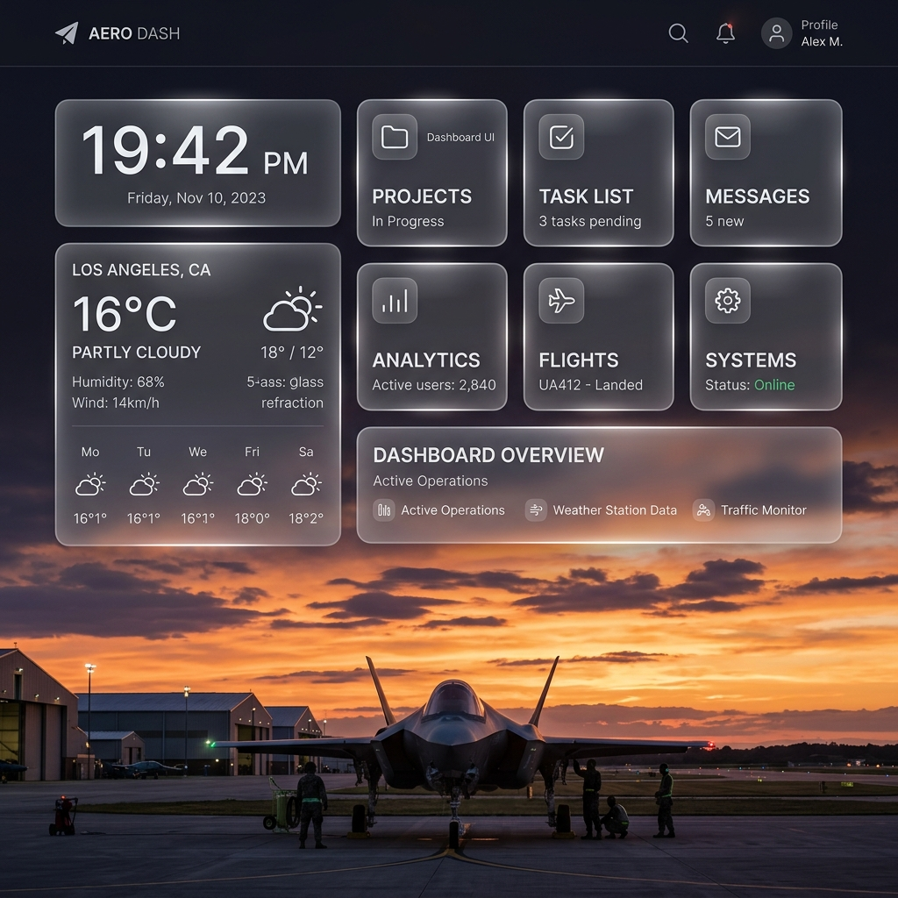

# RAFAC Squadron Homepage Dashboard

A fully customizable, glassmorphic start page and dashboard originally designed for RAF Air Cadets (RAFAC) squadrons, but adaptable for any team or personal use.

It runs entirely in the browser using static HTML, CSS, and JavaScript. There are no backend servers required, making it perfect for hosting on a NAS, a simple web server, or directly from your local file system.

## Features

- **Visual Editor**: Click the pencil icon in the bottom right corner to enter Edit Mode. Add rows, columns, grids, and widgets visually. Move them around and delete them with ease.
- **Glassmorphism UI**: Beautiful, semi-transparent frosted glass design that automatically adapts to the background image.
- **Dynamic Backgrounds**: Cycle through a list of background images automatically.
- **Extensive Widget Library**:
  - **Links**: Create grids of helpful links categorized by topic with Phosphor Icons.
  - **Weather**: Displays current conditions and a multi-day forecast using the Open-Meteo API.
  - **Time**: A sleek digital clock with the current date.
  - **Notes**: Scratchpad for quick memos (saved directly in your layout).
  - **RSS Feed**: Pulls live news or updates from RSS feeds via an RSS2JSON API.
  - **Search**: A quick Google search bar with live auto-suggestions.
  - **Title**: A customizable header with an optional logo.

## Getting Started

1. Clone or download this repository.
2. Open `index.html` in any modern web browser.
3. Click the translucent pencil icon in the bottom right corner to open the **Editor**.

## Configuration

The entire layout, backgrounds, and widget preferences are stored in the `config.js` file. 

Instead of writing this JSON by hand, use the visual editor! 
1. Enter **Edit Mode**.
2. Make your desired layout changes on the canvas.
3. Click the **Global Settings** tab in the sidebar to change the background images, max width, or logo.
4. Click the **Code** tab in the sidebar and hit **Download** (or Copy).
5. Replace your existing `config.js` file with the new output to permanently save your layout!

## Global Settings

The dashboard supports extensive customization through the sidebar:
- **Max Width**: Keep the layout tight (e.g. `1400px`) or span the entire monitor (`100%`).
- **Backgrounds**: Provide a comma-separated list of image URLs. They will cycle automatically based on the chosen interval.
- **Logo URL**: Provide a path to a custom logo (e.g. `assets/roundel.svg`) which displays next to the page title.

## Dependencies
- **Phosphor Icons**: Loaded via CDN for all UI and grid icons.
- **Open-Meteo**: Used for weather forecasting (No API key required).
